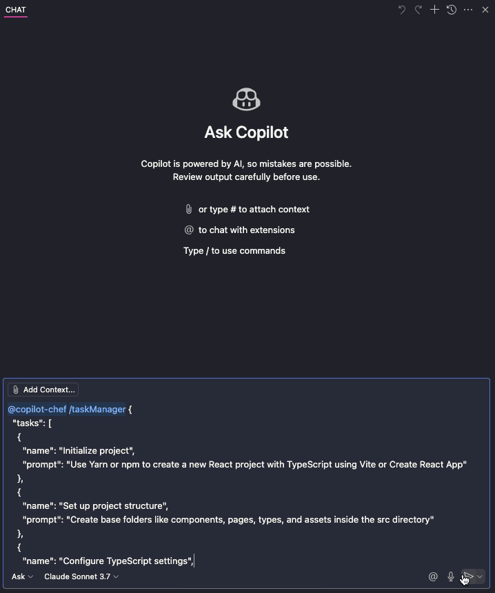

<div align="center">
  
  <h1>Copilot Chef</h1>
</div>

A VS Code extension that turns GitHub Copilot into your personal sous-chef 👨‍🍳—whipping up advanced workflow orchestration, task management, and automation tools. Serve up streamlined AI-assisted development with customizable recipes for your go-to coding dishes.

## Features

This extension provides a chat participant to help with various tasks:

- **Task Manager**: Process JSON input to run multiple agents in parallel
- **Orchestrator**: Generates tasks from a prompt
- **Workflow**: Process JSON input to run a workflow in sequence with optional approval gates


## See it in action

Here is an example of running the task manager (12 tasks) that get run in parallel. All these tasks are being run in parallel, so that run pretty quickly.



## Installation

1. Download the VSIX file from the releases page
2. Install it in VS Code:
   - Open VS Code
   - Go to Extensions view (Ctrl+Shift+X)
   - Click on the "..." menu at the top of the Extensions view
   - Select "Install from VSIX..."
   - Choose the downloaded VSIX file

## Usage

Once installed, you can access the Copilot Chef chat participant in the VS Code chat interface.

### Task Manager

Use the Task Manager to run multiple agents in parallel:

```
@copilot-chef /taskManager {
  "tasks": [
    {
      "name": "Create React component",
      "prompt": "Create a React reusable button component with different states"
    },
    {
      "name": "Write unit tests",
      "prompt": "Create tests for the new button component"
    }
  ]
}
```

### Orchestrator

Use the Orchestrator to generate tasks from a prompt:

```
@copilot-chef /orchestrator Generate a complete login page with form validation
```

### Workflow

Use the Workflow to run a workflow in sequence with optional approval gates:

```
@copilot-chef /workflow {
  "tasks": [
    {
      "name": "Setup project structure",
      "prompt": "Create a directory structure for a new React project"
    },
    {
      "name": "Create components",
      "prompt": "Create React components for the project"
    }
  ]
}
```

## Requirements

- VS Code 1.87.0 or higher
- GitHub Copilot Chat extension

## Development

1. Clone the repository
2. Run `yarn` to install dependencies
3. Run `yarn package` to build the extension
4. Run `yarn create-vsix` to create the VSIX file

## License

MIT
